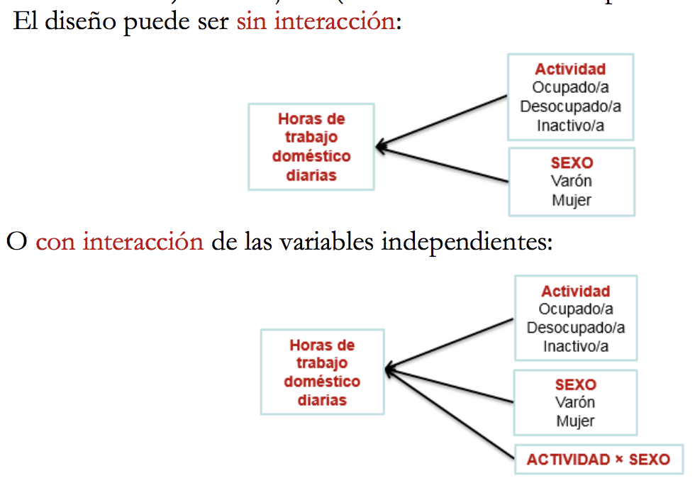

```{r setup, include=FALSE}
knitr::opts_chunk$set(echo = TRUE)
```

```{r load_libraries, include=FALSE}
library(knitr)
```

<hr />

## 1. Preprocesado
###1.1. Carga de datos
Cargar el fichero de datos “Fumadores.csv”.
```{r}
df <- read.csv("data/Fumadores.csv")
head(df)
```

###1.2. Tipos de datos
<p style="text-align: justify">Consultar los tipos de datos de las variables y si es necesario, aplicar las conversiones apropiadas. Averiguar posibles inconsistencias en los valores de Tipo o AE. En caso de que existan inconsitencias, corregidlas.
</p>
```{r}
# Buscando por valores NA
print(unlist(lapply(df, function(x) any(is.na(x)))))

# Reunindo los tipos de variables e imprimindo
res <- sapply(df, class)
kable(data.frame(variables=names(res),clase=as.vector(res)))

summary(df) # se nota (Other) en Tipo, deberíamos tener solo 6 categorías

unique(df$Tipo) # Claramente el problema ha sido detectado - 2 letras minusculas
df <- as.data.frame(sapply(df, toupper))
# Aunque va enseñar solo 2 decimales, R mantiene el número como él era inicialmente
df$AE <- as.numeric(as.character(df$AE))

print(head(df$AE))
str(df)
```

###1.3. Realizar un análisis descriptivo de la muestra en su totalidad en relación a la variable AE
Recordando que la estadística descriptiva se trata de resumir los datos de una muestra (en vez de extraer conclusiones).
```{r}
kable(summary(df)[,1], # 1 posicion AE
      digits=2, align='l', caption="Estadística descriptiva de la variable AE", col.names = "AE")
```

###1.4. Analizar los datos según el tipo de fumador
<p style="text-align: justify">
Mostrar el número de personas en cada tipo de fumador, la media de AE de cada tipo de fumador y un gráfico que muestre esta media. Se recomienda ordenar el gráfico de menos a más AE.
</p>
<p style="text-align: justify">
Luego, se debe representar un boxplot donde se muestre la distribución de AE por cada tipo. Para calcular la media o otras variables para cada tipo de fumador, podéis usar las funciones **summarize** y **group_by** de la libreria **dplyr** que os serán de gran utilidad. Para realizar la visualización de los datos, podéis usar la función **ggplot** de la librería **ggplot2**.
</p>
```{r}
library(ggplot2) # ggplot
category <-  as.data.frame(table(df$Tipo))
category
p <- ggplot(category, aes(x = '', y = Freq, fill = factor(Var1)) ) + geom_bar(width = 1,stat="identity") + coord_polar(theta = "y") +
geom_text(aes(label = Freq), position = position_stack(vjust = 0.5)) + ggtitle("Distibución por Tipo de Fumador")

p + labs(fill = "Tipo Fumador", x ="", y = "Frecuencia de ocurrencias")
###### - distribucion ended ####################

r2 <- setNames(aggregate(df[, c("AE")], list(df$Tipo), mean), c("Tipo", "Media"))
r2 <- r2[order(r2$Media),]
r2

barp <- ggplot(r2, aes(x= reorder(Tipo, Media), y=Media, fill=Tipo, label = format(round(Media, 2), nsmall = 2))) + geom_bar(stat="identity")
barp + ggtitle("Tipo de fumadores") + geom_text(size = 3, position = position_stack(vjust = 0.5))
###### - media por tipo de fumador ended ####################

bp <- ggplot(df, aes(x=Tipo, y=AE, fill=Tipo)) + geom_boxplot()
bp + ggtitle("Distribución Aire Expulsado AE por Tipo de Fumador")
```
<br />Se nota la existencia de *outliers* en FI y FM.
<hr />

## 2. Intervalo de confianza
<p style="text-align: justify">
Calcular el intervalo de confianza de la capacidad pulmonar de toda la muestra. El nivel de confianza es 95 %. Realizar el cálculo manualmente sin usar las funciones t.test o equivalentes. Podéis usar qnorm, qt, pnorm, pt, . . . En cuanto a la elección del método para el cálculo del intervalo de confianza, debéis justificar vuestra elección.
</p>
```{r}
n <- length(df$AE)
m <- mean(df$AE)

conf.level <- 0.95
z <- qt((1+conf.level)/2, df=n-1)
se <- sd(df$AE)/sqrt(n)
ci <- z * se

range_min <- m - ci
range_max <- m + ci

print(paste("Intervalo de confianza: ", range_min, " hasta ", range_max))

# Confirmando el valor
confirm <- t.test(df$AE, mu=5.0, conf.level = conf.level)
confirm$conf.int
```

Para calcular el intervalo de confianza he utilizado una formula según Rumsey (2016) [1]:

##### average +- z-score * standardError

Con el uso de la formula de Rumsey (y también confirmado por `t.test`),  con 95% de confianza, la cantidad de aire expulsado (AE) está entre `r range_min` y `r range_max`, con base en el muestreo de datos.

<hr />
## 3. Comparación de dos muestras: Fumadores vs No Fumadores
<p style="text-align: justify">
¿Podemos afirmar que la capacidad pulmonar de los fumadores es inferior a la de no fumadores? Incluid dentro de la categoría de no fumadores los fumadores pasivos. Realizar el cálculo manualmente sin usar las funciones `t.test` o equivalentes. Podéis usar `qnorm`, `qt`, `pnorm`, `pt` ... Seguid los pasos que se indican a continuación.
</p>
###3.1. Escribir la hipótesis nula y alternativa
Al escribir la hipótesis nula y alternativa, si se trata de comprobar si la capacidad pulmonar de los fumadores es inferior a la de no fumadores se debe plantear así:<br />
<br />
**H *<sub>0</sub> : &mu; <sub>Capac. Fumadores</sub>* =  *&mu; <sub>Capac. No Fumadores</sub>* **
<br />
**H *<sub>1</sub> : &mu; <sub>Capac. Fumadores</sub>* <  *&mu; <sub>Capac. No Fumadores</sub>* **
<br />
<br />
<p style="text-align: justify">
Es decir, se persigue rechazar la hipótesis nula. Al hacerlo, se hace a favor de la alternativa. H0 siempre es la hipótesis nula, y es la que se formula con la igualdad. (*Ester Bernadó Mansilla, orientaciones Tablero*)
</p>

###3.2. Preparar los datos para realizar el contraste
Creando dos data frames que contengan por separado los no fumadores y por otra parte, los fumadores.
```{r}
nrow(df)
no_fumadores <- subset(df, df$Tipo =="NF" | df$Tipo == "FI") # NF - No Fumadores / FP - Fumadores pasivos
fumadores <- subset(df, df$Tipo !="NF" & df$Tipo != "FI")
head(no_fumadores)
tail(no_fumadores)
head(fumadores)
tail(fumadores)

n1 <- length( no_fumadores$AE)
n2 <- length( fumadores$AE)
n1
n2

s1 <- sd( no_fumadores$AE )
s2 <-sd ( fumadores$AE )
s1
s2
```

###3.3. Especificar qué tipo de contraste usaréis
*Podéis consultar Gibergans Baguena (2009).*

<p style="text-align: justify">
Se trata de un **contraste unilateral**, conforme indicado por Baguena (2009) [2], este tipo de contraste es un **contraste de dos muestras sobre la diferencia de medias**.
<p style="text-align: justify">

###3.4. Realizar los cálculos del valor p
```{r}
mean1 <- mean( no_fumadores$AE )
mean2 <- mean( fumadores$AE )
mean1
mean2

S <- sqrt( s1^2/n1 + s2^2/n2)
zobs <- (mean1-mean2)/ S
zobs

alfa <- 1-0.95
zcritical <- qnorm( alfa, lower.tail=FALSE )
zcritical

pvalue <- pnorm( abs(zobs), lower.tail=FALSE )
pvalue
```


###3.5. Interpretar el resultado del contraste
<p style="text-align: justify">
Observando pvalue = `r pvalue` < &alpha;=`r alfa`, rechazamos la hipótesis nula *Capacidad Pulmonar Fumadores = Capacidad Pulmonar No Fumadores* a favor de la hipótesis alternativa.
</p>

A partir del valor crítico, también se llega a la misma observación, puesto que el valor observado `r zobs` > `r zcritical`.


## 4. ANOVA
<p style="text-align: justify">
A continuación se realizará un análisis de varianza, donde se desea comparar la capacidad pulmonar entre los seis tipos de fumadores/no fumadores clasificados previamente. El análisis de varianza consiste en evaluar si la variabilidad de una variable dependiente puede explicarse a partir de una o varias variables independientes, denominadas factores. En el caso que nos ocupa, nos interesa evaluar si la variabilidad de la variable AE puede explicarse por el factor tipo de fumador. Hay dos preguntas básicas a responder:
</p>

+ ¿Existen diferencias entre la capacidad pulmonar (AE) entre los distintos tipos de fumadores/no fumadores?
+ Si existen diferencias, ¿entre qué grupos están estas diferencias?

<p style="text-align: justify">
Para la resolución de esta sección, se seguirán los apuntes de López-Roldán y Fachelli (2015).
</p>

###4.1. Verificar la asunción de normalidad
<p style="text-align: justify">
Atendiendo al material, gráfico III. 8.6 y página 25, evaluar si el conjunto de datos cumple las condiciones de aplicación de ANOVA. Seguid los pasos que se indican a continuación.
</p>

####4.1.1. Representar gráficamente la normalidad de la muestra de datos AE con la función qqnorm
```{r}
NF <- df[df$Tipo == "NF", c("AE")]
FP <- df[df$Tipo == "FP", c("AE")]
NI <- df[df$Tipo == "NI", c("AE")]
FL <- df[df$Tipo == "FL", c("AE")] 
FM <- df[df$Tipo == "FM", c("AE")] 
FI <- df[df$Tipo == "FI", c("AE")]
sum(length(NF), length(FP), length(NI), length(FL), length(FM),length(FI))

qqnorm(df$AE, main = "Todas las categorías (fumadores o no)")
qqline(df$AE)
par( mfrow=c(1,2))
qqnorm(NF, main = "No fumadores")
qqline(NF)
qqnorm(FP, main = "Fumadores pasivos")
qqline(FP)
qqnorm(NI, main = "Fum. No inhalan")
qqline(NI)
qqnorm(FL, main = "Fum. light")
qqline(FL)
qqnorm(FM, main = "Fum. moderado")
qqline(FM)
qqnorm(FI, main = "Fum. intensivos")
qqline(FI)
par( mfrow=c(1,1))

```

####4.1.2. Escribir la hipótesis nula e hipótesis alternativa

<br />
**H *<sub>0</sub> : La distribución es normal* **
<br />
**H *<sub>1</sub> : La distribución no es normal* **
<br />
<br />
<p style="text-align: justify">
Según López-Roldán y Fachelli (2015) [3], para determinar la **condición de normalidad** se aplica una prueba estadística que la determina como la prueba de *Kolmogorov-Smirnov*, u otras como las de *Lilliefors*, *Anderson-Darling* o *Shapiro-Wilk*.
</p>

####4.1.3. Aplicar un test de normalidad
<p style="text-align: justify">
*Aplicar un test de normalidad, siguiendo las recomendaciones del material mencionado López-Roldán y Fachelli (2015). Justificar la elección.*
</p>
```{r}
test_and_define_if_normal <- function(x) {
  sr <- shapiro.test(x)
  
  #valor de significación = alpha <- 0.05
  print(paste(ifelse(sr$p.value >= alfa, "Distribución Normal", "Distribución no normal"), "- p-value: ", sr$p.value))
}


# Son solamente 6 atributos, si fueran mas estableceria un algoritmo, por ejemplo para aplicar todo de golpe con lappy en un dataset
test_and_define_if_normal(NF)
test_and_define_if_normal(FP)
test_and_define_if_normal(NI)
test_and_define_if_normal(FL)
test_and_define_if_normal(FM)
test_and_define_if_normal(FI)

```
<p style="text-align: justify">
La justificativa de mí elección ha sido porque individualmente los conjuntos de datos son de menos de 30 ítems y, aún siguiendo a López-Roldán y Fachelli (2015) [3] si n≤30 se tiene que verificar con la prueba estadística de normalidad de *Shapiro-Wilk*.
</p>
<br />

####4.1.4. Interpretar los resultados a partir del gráfico qqnorm y de los valores que devuelve el test.
<p style="text-align: justify">
Tomando el valor de significación &alpha;= `r alfa` y su comparación con los valores de p-value de los resultados del apartado anterior, podríamos definir que se trata de muestreos de distribución normal. Lo mismo puede ser encontrado si miramos en los gráficos donde también se puede observar la tendencia de seguir la línea trazada por `qqline`.
</p>
<br />

### 4.2. Homoscedasticidad: Homogeneidad de varianzas

<p style="text-align: justify">
Otra de las condiciones de aplicación de ANOVA es la igualdad de varianzas (homoscedasticidad). Aplicar un test para validar si los grupos presentan igual varianza. Seguid las indicaciones de los apuntes de López-Roldán y Fachelli (2015).
</p>
<br />

####4.2.1. Escribir hipótesis nula y alternativa

<br />
**H *<sub>0</sub> : Las varianzas poblacionales son iguales (homoscedasticidad) $\sigma_{1}^2$ = $\sigma_{2}^2$ * **
<br />
**H *<sub>1</sub> : Las varianzas poblacionales son distintas (heteroscedasticidad) $\sigma_{1}^2$ $\neq$ $\sigma_{2}^2$ * **
<br />
<br />

####4.2.2. Realizar los cálculos
<p style="text-align: justify">
Conforme las recomendaciones de Dragonfly Statistics (2013) [4], **Bartlett test** puede ser usado para testar la homogeneidad de varianzas. Además, para soportar la decisión podemos utilizar boxplot para mirar si hay varianzas que són significativamente diferentes.
</p>
<br />
```{r}
boxplot(df$AE~df$Tipo)
bart <- bartlett.test(df$AE~df$Tipo)
bart

# Probando tambien con Levene test
library(lawstat)
levene.test(df$AE, df$Tipo)
```

####4.2.3. Interpretar los resultados
<p style="text-align: justify">
Para el análisis e interpretación de los resultados, seguimos con las orientaciones de Dragonfly Statistics (2013) [4], primero, mirando los box plots, notamos que la formas / tamaños de las cajas son aproximadamente los mismos, dando un inidicio que tenemos un muestreo donde la varianza es homogénea. Nosotros rejectamos la hipótesis nula si p-valor fuera < `r alfa`, sin embargo, el resultado del **Bartlett test** nos enseña `r bart$p.value`  > `r alfa`. Por lo tanto, aceptamos la hipótesis nula.
</p>

###4.3. ANOVA unifactorial (One Way ANOVA)
Calcular ANOVA de un factor (one-way ANOVA o independent samples ANOVA) para investigar si existen diferencias en el nivel de aire expulsado (AE) entre los distintos tipos de fumadores.

####4.3.1. Escribir la hipótesis nula y alternativa
<p style="text-align: justify">
ANOVA unifactorial compara las medias entre los grupos que nos interesan y determina si alguna de esas medias es, en términos estadísticos, significativamente diferente entre sí. Específicamente, prueba la hipótesis nula:
</p>
**H *<sub>0</sub> : &mu; <sub>NF</sub> = &mu; <sub>FP</sub> = &mu; <sub>NI</sub> = &mu; <sub>FL</sub> = &mu; <sub>FM</sub> = &mu; <sub>FI</sub>* **
<br />
**H *<sub>1</sub> : &mu; <sub> al menos 2 grupos son significativamente $\neq$ entre sí* **
<br />
<br />

####4.3.2. Realizar los cálculos
Podéis usar la función **aov.**
```{r}
anova <- aov(df$AE~df$Tipo, df)
anova
summary(anova)
TukeyHSD(anova)
```

####4.3.3. Interpretar los resultados de la prueba ANOVA y relacionarlos con el resultado gráfico del boxplot
<p style="text-align: justify">
Como el *p-value* es menor que el nivel de significación &alpha; = `r alfa`, podemos concluir que hay diferencias significativas entre los grupos resaltados con "*" en el `summary` del modelo.
</p>
<p style="text-align: justify">
Utilizamos también un TukeyHSD para realizar múltiples *pairwise-comparison* entre las medias de los grupos y sumadas también al análisis anterior de los *box plots* podemos decir que se nota que hay $\neq$ significativas entre categorías como, por ejemplo, NF-FI (No fumantes y Fumantes intensos).
</p>

###4.4. Cálculos ANOVA
####4.4.1. Identificar las variables
<p style="text-align: justify">
A partir de los resultados del modelo devuelto por `aov`, identificar las variables SST (Total Sum of Squares), SSW (Within Sum of Squares), SSB (Between Sum of Squares) y los grados de libertad. A partir de estos valores, calcular manualmente el valor F, el valor crítico (a un nivel de confianza del 95%), y el valor p.Interpretar los resultados.
</p>
```{r}
sumSq <- summary(anova)[[1]]$'Sum Sq'

#Manera 1
print(paste("SSW (Within Sum of Squares):",sumSq[2]))
#Manera 2
SSW.aov <- sum( anova$residuals ^ 2 )
SSW.aov

SSB.aov <- sumSq[1]
print(paste("SSB (Between Sum of Squares):", SSB.aov))

SST.aov <- sum(sumSq)
SST.aov

grados_libertad <- summary(anova)[[1]]$'Df'
grados_libertad

k <- 6  #grupos
N <-length( df$AE )
N
F <- (SSB.aov / (k-1)) / (SSW.aov/ (N-k))
F

valor_critico <- qf(1 - alfa, grados_libertad[1], grados_libertad[2])
valor_critico

p_value <- summary(anova)[[1]][["Pr(>F)"]]
p_value[1]
```
<p style="text-align: justify">
El anova unifactorial (Oneway ANOVA) ha enseñado un efecto significativo para categorías de fumadores con relación a capacidad pulmonar, F(`r grados_libertad[1]`, `r grados_libertad[2]`) = `r F`, p < `r alfa` -> `r p_value[1]`< `r alfa`. En otras palabras, podemos rejectar la hipótesis nula de que todos los tipos / categorías de fumadores tienen capacidad pulmonor igual.
</p>

####4.4.2. Calcular manualmente las variables
<p style="text-align: justify">
Calcular manualmente SSB, SSW y SST a partir de los datos de la muestra. Comprobad que el cálculo coincide con los valores que devuelve la función anova. Las funciones summarize y group_by os pueden ser útiles para simplificar los cálculos.
</p>
```{r}
varNF <- sum ((NF - mean(NF)) ^ 2 )
varFP <- sum ((FP - mean(FP)) ^ 2 )
varNI <- sum ((NI - mean(NI)) ^ 2 )
varFL <- sum ((FL - mean(FL)) ^ 2 )
varFM <- sum ((FM - mean(FM)) ^ 2 )
varFI <- sum ((FI - mean(FI)) ^ 2 )

#SSW (Within Sum of Squares): varianza intra grupo
SSW <- varNF + varFP + varNI + varFL + varFM + varFI
SSW

#SST (Total Sum of Squares): varianza total
SST <- sum( (df$AE - mean(df$AE)) ^ 2 )
SST

# SSB (Between Sum of Squares): Varianza entre grupos
SSB <- SST - SSW
SSB

#Comparando los valores extraidos del anova con los calculados
kable(data.frame("Metodo de obtención" = c("Extraído del `aov()`", "Calculado Manualmente")
                 , "SSW" = c(format(round(SSW.aov, 2), nsmall = 2), format(round(SSW, 2), nsmall = 2))
                 , "SSB" = c(format(round(SSB.aov, 2), nsmall = 2), format(round(SSB, 2), nsmall = 2))
                 , "SST" = c(format(round(SST.aov, 2), nsmall = 2), format(round(SST, 2), nsmall = 2))))
```


<p style="text-align: justify">
Conforme hemos visto en la comprobación, los resultados han coincidido.
</p>

###4.5. Calcular la fuerza de la relación e interpretar el resultado
Podéis consultar López-Roldán y Fachelli (2015), p.37.
```{r}
library(lsr)
etaS <- etaSquared(anova)
etaS
summary.lm(anova)
```
<p style="text-align: justify">
Como ha sido definido por López-Roldán y Fachelli (2015) [3], estos datos representán la variabilidad explicada sobre la variabilidad total. El valor obtenido queda entre 0 y 1 midiendo la parte explicada por la variable independiente. 
</p>
En nuestro muestreo se obtiene un valor del **`r etaS[1]`**.
<br />
<hr>

## 5. Comparaciones múltiples
<p style="text-align: justify">
Independientemente del resultado obtenido en el apartado anterior, realizamos un test de comparación múltiple entre los grupos. Este test se aplica cuando el test ANOVA devuelve rechazar la hipótesis nula de igualdad de medias. Por tanto, procederemos como si el test ANOVA hubiera dado como resultado el rechazo de la hipótesis nula.
</p>

###5.1. Sin corrección
Calcular las comparaciones entre grupos sin ningún tipo de corrección. Podéis usar la función pairwise.t.test.
```{r}
pairwise.t.test(df$AE, df$Tipo, p.adj = "none")
```

###5.2. Corrección de Bonferroni
Aplicar la corrección de Bonferroni en la comparación múltiple. Interpretar el resultado y contrastar el resultado con el obtenido sin corrección.
```{r}
pairwise.t.test(df$AE, df$Tipo, p.adj = "bonferroni")
```
<p style="text-align: justify">
Tal como lo define Quick (2011) [5], el ajuste de **Bonferroni** simplemente divide la tasa del error de Tipo I (.05) por el número de pruebas (en este caso, seis). Por lo tanto, este método a menudo se considera demasiado conservador.
</p>
<p style="text-align: justify">
Usando el ajuste de **Bonferroni**, solo la comparación NF - \* y FI - {FP, NF o NI} son estadísticamente significativas. Tenga en cuenta que estos resultados son más conservadores que sin ningún ajuste. Por ejemplo, **sin ajustes** la comparación NI - {FL o FM} también era considerada significativa.
<p>


###5.3. Prueba de Scheffé
<p style="text-align: justify">
La prueba de Scheffé es una de las más usadas cuando se cumplen condiciones de igualdad de varianza. Según López, está basada en la distribución F. Permite la comparación binaria entre pares de medias y también la comparación múltiple. En las comparaciones de pares es conservadora. Se puede aplicar con muestras de tamaño desigual y es bastante robusta ante el incumplimiento de la condición de homoscedasticidad.
</p>
Aplicad la prueba de Scheffé e interpretar el resultado.
```{r}
library(agricolae)
scheffe.test(anova,"df$Tipo", group=FALSE,console=TRUE, main="Capacidad Pulmonar de Fumadores y no fumadores")
```
<p style="text-align: justify">
La segunda tabla de resultados proporciona la comparación por pares de las medias para todas las posibles combinaciones de grupos. La comparación debe hacerse en la columna 'Difference' de la segunda tabla con el 'Valor crítico de F', y los valores p se generan en función de eso. Simplemente verificamos la columna p-value, si es menor que `r alfa`, indica que la media para los dos grupos es diferente.
</p>
<p style="text-align: justify">
En nuestro ejemplo: *'FI - NF'*, *'FI - NI'*, *'FL - NF'*, *'FM - NF'*, *'FP - NF'*, *'NF - NI'* tienen un valor de p < `r alfa`, que dice que la media de los grupos definidos son significativamente diferentes.
</p>
<br />
<hr>
## 6. ANOVA multifactorial
<p style="text-align: justify">
En una segunda fase de la investigación se evaluó el efecto del sexo como variable independiente. Con este objetivo, se recolectó un segundo conjunto de datos con las variables independientes sexo y nivel de fumador y con la variable dependiente capacidad pulmonar medida según el aire expulsado, al igual que con el primer conjunto de datos. Este conjunto de datos se encuentra en el fichero `Fumadores2.csv`.
</p>

### 6.1. Estudiar los efectos principales y posibles interacciones
<p style="text-align: justify">
Examinar las características del conjunto de datos y realizar un estudio visual de los datos. A continuación, aplicad ANOVA. Seguid los pasos que se indican a continuación.
</p>

####6.1.1. Análisis visual
<p style="text-align: justify">
Se realizará un primer estudio visual para determinar si sólo existen efectos principales o hay efectos de interacción entre sexo y tipo de fumador. Para ello, seguir los pasos que se indican a continuación:
</p>
#####1. 
Leer el conjunto de datos
```{r}
df2 <- read.csv("data/Fumadores2.csv")
head(df2)

# Buscando por valores NA
print(unlist(lapply(df2, function(x) any(is.na(x)))))

# Reunindo los tipos de variables e imprimindo
res2 <- sapply(df2, class)
kable(data.frame(variables=names(res2),clase=as.vector(res2)))

summary(df2)

unique(df2$Tipo) 
unique(df2$Sex) 
```


#####2. 
<p style="text-align: justify">
Agrupar el conjunto de datos por tipo de fumador y sexo y calcular la media de AE en cada grupo. Podéis usar las instrucciones `group_by` y `summarise` de la librería `dplyr` para realizar este proceso. Mostrar el conjunto de datos en forma de tabla, donde se muestre la media de cada grupo según el sexo y tipo de fumador.
</p>
```{r}
library(magrittr)
library(dplyr)
attach(df2)
fum2 <- df2 %>%
  select(AE, Tipo, Sex) %>%
  group_by(Tipo, Sex) %>%
  summarise(AE = mean(AE))

kable(fum2)
```


#####3. 
<p style="text-align: justify">
Mostrar en un plot el valor de AE medio para cada tipo de fumador y sexo. Podéis inspiraros en los gráficos de López-Roldán y Fachelli (2015), p.38. Podéis realizar este tipo de gráfico usando la función `ggplot` de la librería `ggplot2`.
</p>
```{r}
ggplot(data=fum2, aes(x=reorder(Tipo, AE), y=AE, group=Sex)) +
  geom_line(aes(color=Sex))+
  geom_point(aes(color=Sex))+
  labs(title="Capacidad Pulmonar por Tipo de Fumador y Sexo")
```


#####4. 
<p style="text-align: justify">
Interpretar el resultado sobre si existen sólo efectos principales o existe interacción. Si existe interacción, explicar cómo se observa y qué efectos produce esta interacción.
</p>
</br>
<p style="text-align: justify">
Para quedar 100% claro sobre los efectos con y sin interacción, voy a usar una imagen bastante interesante de López-Roldán y Fachelli (2015).
</p>

<p style="text-align: justify">
El diseño del problema que estamos trabajando es *con interacción* y notamos que esto se puede decir porque la diferencia entre los valores medios de `AE` cambian especialmente entre **FL**, **FM** y **FI** (diría que más en **FL**). En resumen, la combinación de `Tipo` + `Sexo` sí que influye en el resultado final.
</p>
<br />
####6.1.2. ANOVA multifactorial
<p style="text-align: justify">
Calcular ANOVA multifactorial para evaluar si la variable dependiente AE se puede explicar a partir de las variables independientes sexo y tipo de fumador. Incluid el efecto de la interacción sólo si se ha observado dicha interacción en el análisis visual del apartado anterior. Interpretad el resultado.
</p>
<hr>
## Referencias
<p style="text-align: justify">
[1] Rumsey, D. (2016) *"How to calculate a confidence interval for a population mean when you know its standard deviation"*. [artículo en línea]. [Fecha de consulta: 06 de junio del 2018]. 
http://www.dummies.com/education/math/statistics/how-to-calculate-a-confidence-interval-for-a-population-mean-when-you-know-its-standard-deviation/
</p>
<br />
<p style="text-align: justify">
[2] Baguena, J. (2009) *“Contraste de Dos Muestras.”* In Estadística, edited by Josep Gibergans Baguena, Angel J. Gil Estallo, and Carles Rovira Escofet. Barcelona: FUOC.
</p>
<br />
<p style="text-align: justify">
[3] López-Roldán, P. y Fachelli, S. (2015) *"Metodología de la Investigación Social Cuantitativa"* 1ª edición, Barcelona: Universitat Autònoma de Barcelona. [artículo en línea]. [Fecha de consulta: 10 de junio del 2018].
https://ddd.uab.cat/pub/caplli/2016/163568/metinvsoccua_cap3-8a2016.pdf
</p>
<br />
<p style="text-align: justify">
[4] Dragonfly Statistics (2015) *"R Tutorial : Bartlett Test"* [artículo en línea]. [Fecha de consulta: 12 de junio del 2018].
https://www.youtube.com/watch?v=CMPn0eJ1zqs
</p>
<br />
<p style="text-align: justify">
[5] Quick, J. (2011) *"R Tutorial Series: ANOVA Pairwise Comparison Methods"* [artículo en línea]. [Fecha de consulta: 13 de junio del 2018].
https://www.r-bloggers.com/r-tutorial-series-anova-pairwise-comparison-methods/
</p>